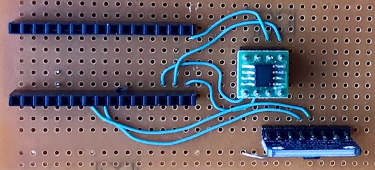

# JeeH

JeeH is a runtime library for STM32 microcontrollers. It offers an alternative
to the ones included with the Arduino IDE, STM32CubeMX, and others.

**Features**

- Based on messages for synchronisation and (optionally) multi-threaded.
- Written in C++17 with limited use of templates and not dependent on STL.
- The build environment is PlatformIO, for either command-line or IDE use.
- Compiled code relies on the CMSIS framework's startup and linker files.
- JeeH is _very_ Lean and Mean. All its source code is in the public domain.

**Status**

JeeH is in active development. All the API and naming conventions can change.  
Latest changes are in the `dev` branch of <https://git.sr.ht/~jcw/jeeh/refs>.  
Issues & bugs are (not actively) tracked at <https://todo.sr.ht/~jcw/issues>.  
Documentation? Yeah, some day... For now just <https://jc.wippler.nl/posts/>.

**Baseline tests**

Run all tests on the attached board with: **`pio test`**

- **smoke** - quick check that the test setup works
- **worker** - basic tests for `Event` and `Worker`
- **rtc** - built-in Real Time Clock test (using LSI, not LSE)
- **tick** - set up SysTick interrupt and test timer chain in `Ticker`
- **exti** - set up EXTI interrupts and test `ExtIrq` (needs PA9-PA10 jumper)
- **uart** - test variants of the UART driver (needs same PA9-PA10 jumper)
- **spi** - test variants of the SPI driver (needs SPI flash chip)
- **rng** - a quick check that the random number generator h/w works
- **analog** - verify that the DAC and ADC work (this needs PA4-PA7 jumper)
- **crc** - check that the cyclic redundancy check hardware works
- **i2c** - test variants of the I2C driver (needs I2C FRAM chip)

Serial output is 1,000,000 baud @ 16 MHz or 10,000,000 baud @ 160 MHz.

Test setup for external SPI flash and I2C FRAM:

- SPI: MOSI=B5 MISO=B4 SCLK=B3 SSEL=A11 (W25Q16: 2 MB)
- I2C: SDA=B7 SCL=A15 (MB85RC256V: 32 KB)
