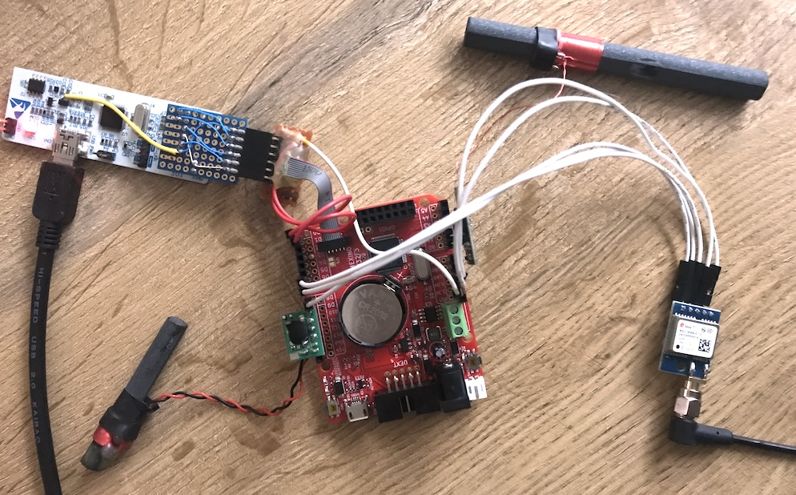

### Example code for an Olimexino F303RC board.

DCF77 module connections:

* data = PA4 (w/ pull-up), power on = PB7 (inverted).

MSF60 module connections:

* data = PC2 (w/ pull-up), power on = PC1 (both inverted).

GPS module connections:

* gps-pps = PA8, gps-rx = PA9, gps-tx = PA10 (D6/D7/D8).

Demo hookup:

