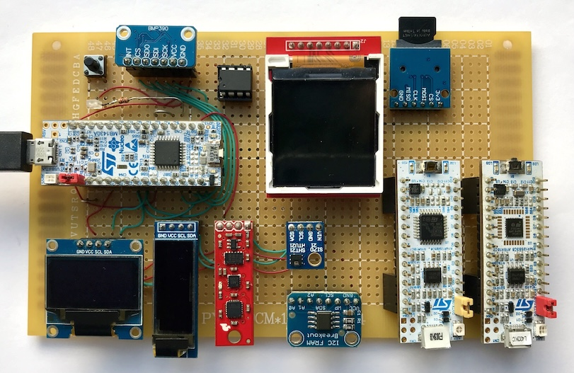
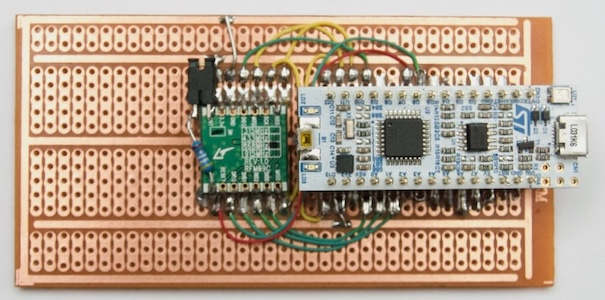

### Example code for a Nucleo-32 G431KB board.

These examples are for use with this board:



(the two Nucleo's at the bottom right are just parked there for swapping out)

- SPI: BMP390, 32 KB SRAM, 128x128 TFT LCD, µSD card
- I2C: BMP390, 128x64 OLED, 128x32 OLED, IMU, SHT21, 32 KB FRAM

```text
i2c: STM32G431xx @ 160 MHz - 2024-12-02 20:46:01.019
	 i2c=B7:OH4,A15  spi=B5:H5,B4,B3,A11:HP  uart=A2:U7,A3
	 led=B8  vcc=B6  bmp=A11  lcd=A12  sram=B0  sd=A7
00:                         -- -- -- -- -- -- -- --
10: -- -- -- -- -- -- -- -- -- -- -- -- -- -- 1E --
20: -- -- -- -- -- -- -- -- -- -- -- -- -- -- -- --
30: -- -- -- -- -- -- -- -- -- -- -- -- 3C 3D -- --
40: 40 -- -- -- -- -- -- -- -- -- -- -- -- -- -- --
50: 50 -- -- 53 -- -- -- -- -- -- -- -- -- -- -- --
60: -- -- -- -- -- -- -- -- 68 -- -- -- -- -- -- --
70: -- -- -- -- -- -- -- 77
```

Hard-wired: A4 <=> A1 (DAC & ADC), P9 <=> P10 (USART1 RX & TX).

---

Another board is used for tests with an RFM69 radio module:



Header | Nucleo | STM32 | RFM69 | Notes  |
------:|:------:|-------|-------|--------|
`3-01` | D1     | PA9   |       |        |
`3-02` | D0     | PA10  |       |        |
`3-03` | RESET  | NRST  |       |        |
`3-04` | GND    | -     |       |        |
`3-05` | D2     | PA12  |       |        |
`3-06` | D3     | PB0   |       |        |
`3-07` | D4     | PB7   |       |        |
`3-08` | D5     | PA15  | DIO5  |        |
`3-09` | D6     | PB6   | RESET |        |
`3-10` | D7     | PF0   |       | OSC32  |
`3-11` | D8     | PF1   |       | OSC32  |
`3-12` | D9     | PA8   | DIO3  |        |
`3-13` | D10    | PA11  | NSS   |        |
`3-14` | D11    | PB5   | MOSI  |        |
`3-15` | D12    | PB4   | MISO  |        |
`4-01` | VIN    | -     |       |        |
`4-02` | GND    | -     |       |        |
`4-03` | RESET  | NRST  |       |        |
`4-04` | +5V    | -     |       |        |
`4-05` | A7     | PA2   |       | VCP TX |
`4-06` | A6     | PA7   |       |        |
`4-07` | A5     | PA6   |       |        |
`4-08` | A4     | PA5   |       |        |
`4-09` | A3     | PA4   |       |        |
`4-10` | A2     | PA3   | DIO2  | VCP RX?|
`4-11` | A1     | PA1   | DIO1  |        |
`4-12` | A0     | PA0   | DIO0  |        |
`4-13` | AREF   | -     |       |        |
`4-14` | +3V3   | -     |       |        |
`4-15` | D13    | PB3   | SCK   | LED    |

Sample output, see `all.cpp` for details:

```text
sync: STM32G431xx @ 160 MHz - 2024-12-13 23:12:44.000
	 i2c=B7:OH4,A15  spi=B5:H5,B4,B3  uart=A2:U7,A3
	 led=B8  vcc=B6  bmp=A11  lcd=A12  sram=B0  sd=A7
                                                            I2C - SCAN
00:                         -- -- -- -- -- -- -- --
10: -- -- -- -- -- -- -- -- -- -- -- -- -- -- 1E --
20: -- -- -- -- -- -- -- -- -- -- -- -- -- -- -- --
30: -- -- -- -- -- -- -- -- -- -- -- -- 3C 3D -- --
40: 40 -- -- -- -- -- -- -- -- -- -- -- -- -- -- --
50: 50 -- -- 53 -- -- -- -- -- -- -- -- -- -- -- --
60: -- -- -- -- -- -- -- -- 68 -- -- -- -- -- -- --
70: -- -- -- -- -- -- -- 77
        HMC5883 @ 0x1E: OK
    128x32 OLED @ 0x3C: OK
    128x64 OLED @ 0x3D: OK
          SHT21 @ 0x40: OK
     32 KB FRAM @ 0x50: OK
        ADXL345 @ 0x53: OK
        ITG3200 @ 0x68: OK
         BMP390 @ 0x77: OK
                                                            I2C - OLED
clear 1: 14017 µs
 oled 1:  6246 µs
clear 2:  7012 µs
 oled 2:  3123 µs
                                                            I2C - FRAM
EE EE ... EE EE
EE EE ... EE EE
EE EE ... EE EE
80 80 ... 81 81
81 81 ... EE EE
80 81 EE
                                                             I2C - IMU
hmc5883 compass: xyz =     83   -264    -47
hmc5883 compass: xyz =     83   -263    -48
hmc5883 compass: xyz =     81   -263    -49
adxl345 accel:   xyz =     31     -2    238
adxl345 accel:   xyz =     34     -3    239
adxl345 accel:   xyz =     31     -2    238
itg3200 gyro:    xyz =     -8     26      7
itg3200 gyro:    xyz =     -9     28      8
itg3200 gyro:    xyz =     -7     26      7
                                                           I2C - SHT21
T: 19.82 °C RH: 45.16 %
T: 19.83 °C RH: 45.11 %
T: 19.83 °C RH: 45.06 %
                                                          I2C - BMP390
raw T: 007CF200 P: 005DF300 => T: 20.936 °C P: 1022.473 hPa
raw T: 007CF400 P: 005DF500 => T: 20.945 °C P: 1022.450 hPa
raw T: 007CF600 P: 005DF300 => T: 20.954 °C P: 1022.518 hPa
                                                          SPI - BMP390
raw T: 007CF900 P: 005DF600 => T: 20.968 °C P: 1022.485 hPa
raw T: 007CFC00 P: 005DF600 => T: 20.982 °C P: 1022.519 hPa
raw T: 007CFD00 P: 005DF900 => T: 20.986 °C P: 1022.463 hPa
                                                             SPI - LCD
init      40 µs
clear  31863 µs
pixel     18 µs
font1   7485 µs (16 ch, 88 px)
font2   8854 µs (16 ch, 112 px)
font3   3932 µs (6 ch, 54 px)
                                                            SPI - SRAM
 000: 00000000 00000000 00006865 6c6c6f00 .... .... ..he llo.
 010: 00000000 776f726c 64000000 00000000 .... worl d... ....
 020: 00000000 00000000 00006865 6c6c6f2d .... .... ..he llo-
 030: 7370692d 776f726c 64000000 00000000 spi- worl d... ....
                                                                  DONE
```
