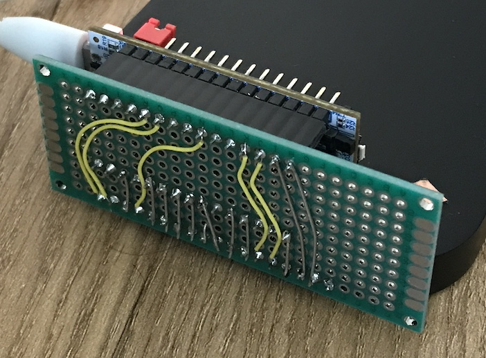

**Nucleo-32 STM32 G431K or L432K with GPIO pins tied to a Logic Analyser.**

```text
Conn | Board | LA  | G431 | Notes | L432 | Notes        LA | G431 | L432 | Notes 
-----|-------|-----|------|-------|------|------        ---|------|------|------
R-1  | VIN   |     | -    |       | -    |               0 |  A12 |  A12 |       
R-2  | GND   |     | -    |       | -    |               1 |  B0  |  B0  |       
R-3  | TNRST | D2  | RST  |       | RST  |               2 |  ST  |  ST  |       
R-4  | 5V    |     | -    |       | -    |               3 |  B6  |  B1  |       
R-5  | A7    | D4  | PA2  | UART  | PA2  | UART          4 |  A2  |  A2  | UART  
R-6  | A6    | D5  | PA7  |       | PA7  |               5 |  A7  |  A7  |       
R-7  | A5    | D6  | PA15 | I2C   | PA6  |               6 |  A15 |  A6  | (I2C)
R-8  | A4    | D7  | PB7  | I2C   | PA5  |               7 |  B7  |  A5  | (I2C)
R-9  | A3    | D8  | PA4  |       | PA4  |               8 |  A4  |  A4  |       
R-10 | A2    |     | PA3  | UART  | PA3  |               9 |  A1  |  A1  |       
R-11 | A1    | D9  | PA1  |       | PA1  |              10 |  A0  |  A0  |       
R-12 | A0    | D10 | PA0  |       | PA0  |              11 |  A8  |  A8  |       
R-13 | AVDD  |     | -    |       | -    |              12 |  A11 |  A11 | SPI   
R-14 | 3V3   |     | -    |       | -    |              13 |  B3  |  B3  | SPI   
R-15 | D13   | D13 | PB3  | SPI   | PB3  | SPI          14 |  B5  |  B5  | SPI   
L-1  | D1    |     | PA9  | UART  | PA9  | UART         15 |  B4  |  B4  | SPI   
L-2  | D0    |     | PA10 | UART  | PA10 | UART  
L-3  | TNRST |     | RST  | dupl  | RST  | dupl  
L-4  | GND   |     | -    |       | -    |       
L-5  | D2    | D0  | PA12 |       | PA12 |       
L-6  | D3    | D1  | PB0  |       | PB0  |       
L-7  | D4    |     | PB7  | dupl  | PB7  |       
L-8  | D5    |     | PA15 | dupl  | PB6  |       
L-9  | D6    | D3  | PB6  |       | PB1  |       
L-10 | D7    |     | PF0  | OSC   | PC14 | OSC   
L-11 | D8    |     | PF1  | OSC   | PC15 | OSC   
L-12 | D9    | D11 | PA8  |       | PA8  |       
L-13 | D10   | D12 | PA11 | SPI   | PA11 | SPI   
L-14 | D11   | D14 | PB5  | SPI   | PB5  | SPI   
L-15 | D12   | D15 | PB4  | SPI   | PB4  | SPI   
```

**Logic Analyser hookup:**



