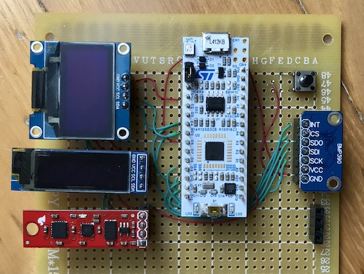

**Readout of a BMP390 and other sensors via either I2C or SPI.**

Note: `L` = left 15-pin connector (CN3), `R` = right 15-pin connector (CN4)

Pin | GPIO | BMP390 | Arduino | Use
----|------|:------:|:-------:|-------
L7  | PB7  | SDI    | D4      | SDA
L8  | PB6  | SCK    | D5      | SCL
L9  | PB1  | VCC    | D6      | POWER
L12 | PA8  | INT    | D9      | IRQ
L13 | PA11 | CS     | D10     | NSEL
L14 | PB5  | SDI    | D11     | MOSI
L15 | PB4  | SDO    | D12     | MISO
R2  | -    | GND    | GND     | GND
R3  | NRST | -      | RESET   | BUTTON
R15 | PB3  | SCK    | D13     | SCLK

With several I2C devices attached:

```
i2c-poll: STM32L412 @ 80 MHz
00:                         -- -- -- -- -- -- -- --
10: -- -- -- -- -- -- -- -- -- -- -- -- -- -- 1E --
20: -- -- -- -- -- -- -- -- -- -- -- -- -- -- -- --
30: -- -- -- -- -- -- -- -- -- -- -- -- 3C 3D -- --
40: -- -- -- -- -- -- -- -- -- -- -- -- -- -- -- --
50: -- -- -- 53 -- -- -- -- -- -- -- -- -- -- -- --
60: -- -- -- -- -- -- -- -- 68 -- -- -- -- -- -- --
70: -- -- -- -- -- -- -- 77
```

- `0x1E` = HMC5883 - compass
- `0x3C` - SSD1306 - 128x32 OLED
- `0x3D` - SSD1306 - 128x64 OLED
- `0x53` - ADXL345 - accelerometer
- `0x68` - ITG3200 - gyroscope
- `0x77` - BMP390 - temperature and pressure


