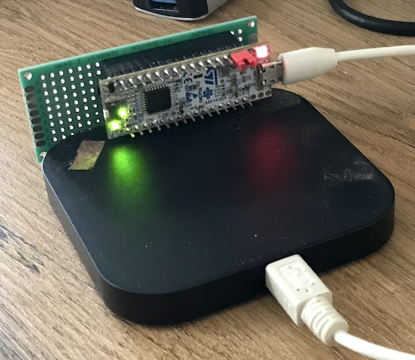

**Nucleo-32 STMG431KB with GPIO pins tied to a Logic Analyser.**

    Conn | Name  | GPIO | LA | Notes
    -----|-------|------|----|------
    R-1  | VIN   | -    |    | 
    R-2  | GND   | -    |    | 
    R-3  | TNRST | RST  | 2  | 
    R-4  | 5V    | -    |    | 
    R-5  | A7    | PA2  | 4  | uart TX
    R-6  | A6    | PA7  | 5  | 
    R-7  | A5    | PA15 | 6  | I2C
    R-8  | A4    | PB7  | 7  | I2C
    R-9  | A3    | PA4  | 8  | 
    R-10 | A2    | PA3  |    | uart
    R-11 | A1    | PA1  | 9  | 
    R-12 | A0    | PA0  | 10 | 
    R-13 | AVDD  | -    |    | 
    R-14 | 3V3   | -    |    | 
    R-15 | D13   | PB3  | 13 | SPI
    L-1  | D1    | PA9  |    | uart
    L-2  | D0    | PA10 |    | uart
    L-3  | TNRST | RST  |    | dupl
    L-4  | GND   | -    |    | 
    L-5  | D2    | PA12 | 0  | 
    L-6  | D3    | PB0  | 1  | 
    L-7  | D4    | PB7  |    | dupl
    L-8  | D5    | PA15 |    | dupl
    L-9  | D6    | PB6  | 3  | 
    L-10 | D7    | PF0  |    | osc
    L-11 | D8    | PF1  |    | osc
    L-12 | D9    | PA8  | 11 | 
    L-13 | D10   | PA11 | 12 | SPI
    L-14 | D11   | PB5  | 14 | SPI
    L-15 | D12   | PB4  | 15 | SPI

**Logic Analyser hookup:**

