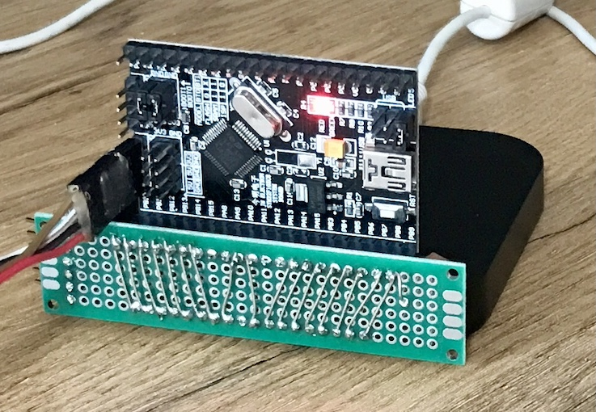

**No-brand STM32F132 with 16 GPIO pins tied to a Logic Analyser.**

Pos Name Pin Use Channel
1  VIN
2  GND
3  TNRST   RST
4  5V
5  A7      PA2  uart TX (include)
6  A6      PA7
7  A5      PA15
8  A4      PB7
9  A3      PA4
10 A2      PA3  uart
11 A1      PA1
12 A0      PA0
13 AVDD    
14 3V3
15 D13     PB3

1  D1      PA9  uart
2  D0      PA10 uart
3  TNRST
4  GND
5  D2      PA12
6  D3      PB0
7  D4      PB7  dupl
8  D5      PA15 dupl
9  D6      PB6
10 D7   
11 D8   
12 D9      PA8
13 D10     PA11
14 D11     PB5
15 D12     PB4

Pos | Pin | Channel
---:|-----|--------
 1 | B10 | 0
 2 | B11 | 1
 3 | B12 | 2
 4 | B13 | 3
 5 | B14 | 4
 6 | B15 | 5
 7 | A8  | 6
 8 | A11 | 7
 9 | A12 | 8
10 | A15 | 9
11 | B3  | 10
12 | B4  | 11
13 | B5  | 12
14 | B6  | 13
15 | B7  | 14
16 | B8  | 15
17 | B9  | GND

**Logic Analyser hookup:**

