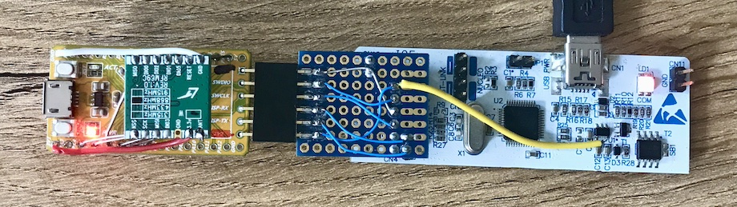

## Explorations using the "Hy-Tiny" board with an STM32F103TB.

There's an RFM69 868 MHz module mounted on top:

GPIO | RFM69 | Note
-----|-------|-----
PA4  | NSS   | NSEL
PA5  | SCK   | SCLK
PA6  | MISO  | MISO
PA7  | MOSI  | MOSI
PB0  | DIO3  | -
PA15 | DIO5  | -
PB3  | DIO1  | -
PB4  | DIO2  | -
PB5  | DIO0  | -
PA8  | NRST  | RESET

On the right, the Hy-Tiny is attached to an ST-Link v2.1 from a Nucleo board:

The 6-pin header connects to power (3.3V+GND), SWD (CK+IO), and USART1 (RX+TX).
