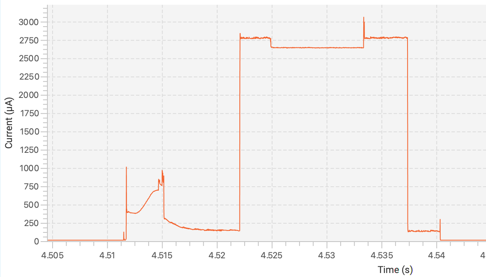
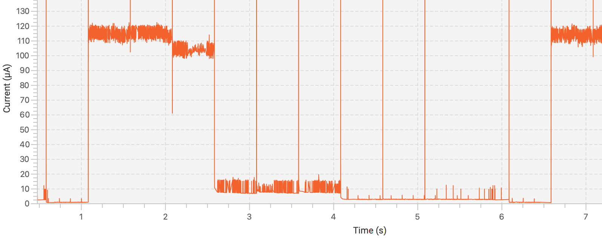
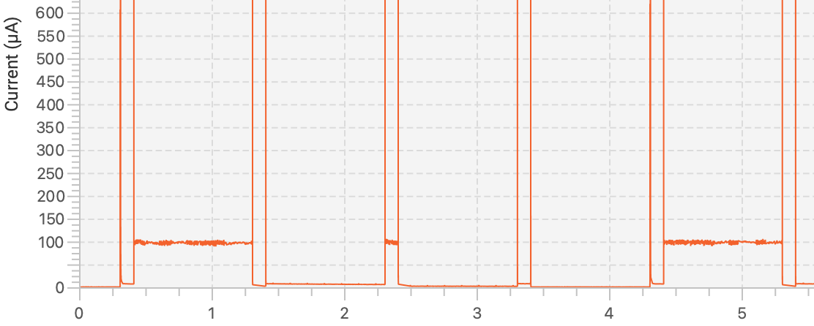
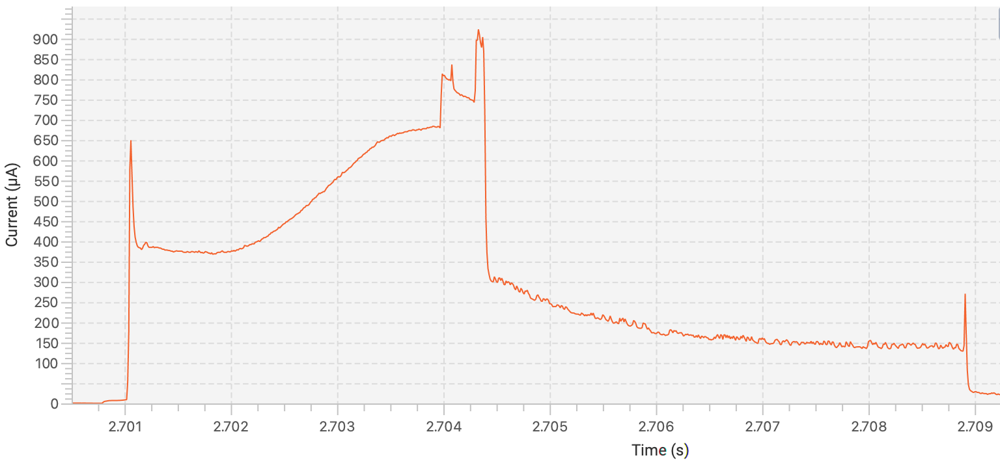

**Sleep mode explorations with a Nucleo-L432KC board.**

Power draw has been measured with the `X-NUCLEO-LPM01A` board (1 nA to 50 mA),  
see <https://www.st.com/en/evaluation-tools/x-nucleo-lpm01a.html>.

Results have been graphed with STM's `STM32CubeMonitor-Power` app,  
see <https://www.st.com/en/development-tools/stm32-lpm01-xn.html>.

### `blink.cpp`

### `stop.cpp`

### `alarm.cpp`

### `coma.cpp`

