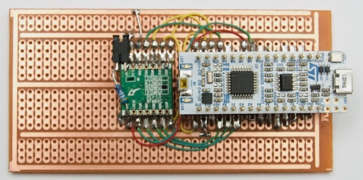

**Low-power explorations using a Nucleo-L031K6 as sensor node w/ RFM69.**

Header | Nucleo | STM32 | RFM69 | Notes | RFM95 ?
------:|:------:|-------|-------|-------|--------
`3-01` | D1     | PA9   |       |       | DIO1
`3-02` | D0     | PA10  |       |       | DIO0
`3-03` | RESET  | NRST  |       |       | 
`3-04` | GND    | -     |       |       | 
`3-05` | D2     | PA12  |       |       | DIO2
`3-06` | D3     | PB0   |       |       | DIO3
`3-07` | D4     | PB7   |       |       | DIO4
`3-08` | D5     | PB6   | DIO5  |       | 
`3-09` | D6     | PB1   | RESET |       | RESET
`3-10` | D7     | PC14  |       | OSC32 | 
`3-11` | D8     | PC15  |       | OSC32 | 
`3-12` | D9     | PA8   | DIO3  |       | 
`3-13` | D10    | PA11  | NSS   |       | 
`3-14` | D11    | PB5   | MOSI  |       | 
`3-15` | D12    | PB4   | MISO  |       | 
`4-01` | VIN    | -     |       |       | 
`4-02` | GND    | -     |       |       | 
`4-03` | RESET  | NRST  |       |       | 
`4-04` | +5V    | -     |       |       | 
`4-05` | A7     | PA2   |       | ST-Lin|       
`4-06` | A6     | PA7   |       |       | NSS
`4-07` | A5     | PA6   |       |       | MOSI
`4-08` | A4     | PA5   |       |       | MISO
`4-09` | A3     | PA4   |       |       | SCK
`4-10` | A2     | PA3   | DIO2  |       | 
`4-11` | A1     | PA1   | DIO1  |       | 
`4-12` | A0     | PA0   | DIO0  |       | 
`4-13` | AREF   | -     |       |       | 
`4-14` | +3V3   | -     |       |       | 
`4-15` | D13    | PB3   | SCK   | LED   | 
